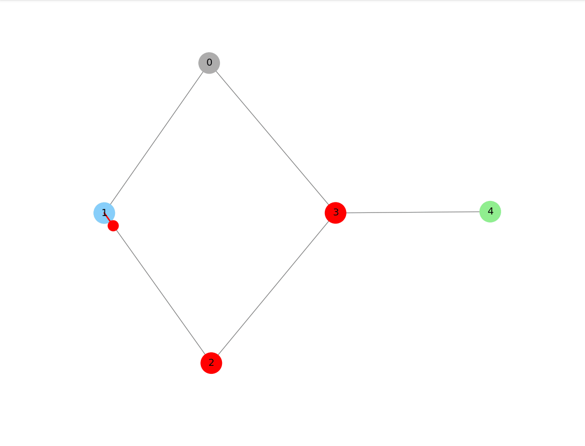
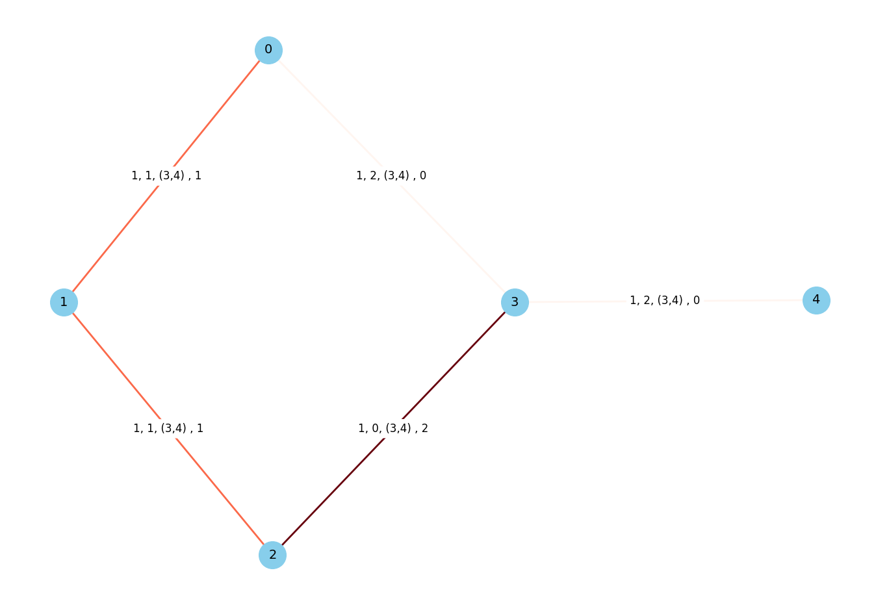

# University Graph-Based Transport System

This project is a **Python implementation** of a University Transport and booking system,
**using an adjacency list graph representation.**<br>
It was developed as a course project for **Algorithm Design**.

The system models universities and routes as a **graph** and provides intelligent route planning, booking,
and trip optimization.

---




---
## Features

### Phase 1: University Graph Construction
- Models universities and connections as a **weighted graph**.
- Uses **Minimum Spanning Tree (MST)** algorithms (Prim) to minimize construction costs.
- Ensures each university is reachable within a limited radius using **BFS**.
- Supports **dynamic insertion** of new universities without reconstructing the entire graph.

### Phase 2: Intelligent Booking System
- Allows students to book inter-university trips.
- Suggests **optimal paths** based on **minimum cost** using **Dijkstra**.
- Manages seat capacity and prevents overbooking.
- Maintains a **priority queue** for pending reservations if routes are full.
- Includes **visualization** (graphs and heatmaps) to show real-time usage.

### Phase 3: Multi-Trip Optimization
- Handles travel requests where a student needs to visit multiple universities in one day.
- Uses **Dynamic Programming (Bitmasking)** and Computes the best visiting order to minimize total cost.


---

### Core Libraries:
- [NetworkX](https://networkx.org/) – for graph visualization
- [PyGraphviz](https://pygraphviz.github.io/) – to compute node coordinates for layout
- [Matplotlib](https://matplotlib.org/) – renders the final plots and heatmaps
- [NumPy](https://numpy.org/) – Numerical computations

All graph algorithms and data structures (MST, BFS, Dijkstra, Priority Queue, TSP with DP, etc.)
are **implemented from scratch** using an **adjacency list** representation.

---

## Prerequisites

This project requires **Graphviz** to be installed before installing Python dependencies (because of `pygraphviz`).

### Install Graphviz

- **Linux (Debian/Ubuntu):**
  ```bash
  sudo apt-get update
  sudo apt-get install graphviz graphviz-dev
  ```
- **macOS (Homebrew):**
  ```bash
  brew install graphviz
  ```

- **Windows:**

    - Download and install Graphviz from: https://graphviz.org/download/


## Getting Started
- Clone the repository:
```bash
  git clone https://github.com/AshkanRN/ad-project.git
```
```bash
  cd ad-project
```

- Install Python dependencies:
```bash
  pip install -r requirements.txt
```

- Run:
```bash
  python main.py
```


